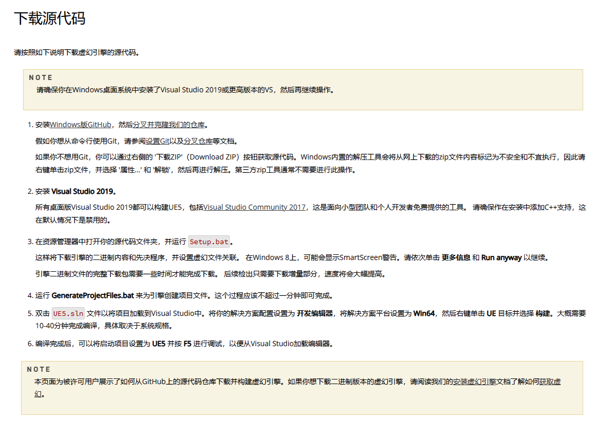
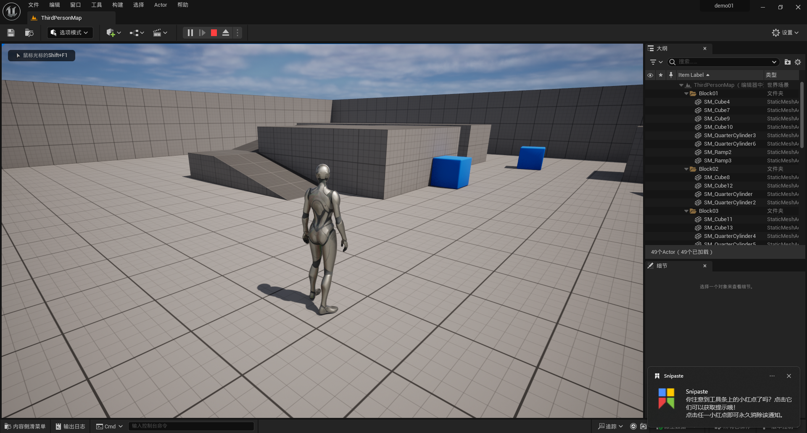

# UE5 学习笔记1：源码构建虚幻引擎

## 1. 下载Unreal源代码

首先，获得Unreal源码仓库授权，官网[提供的步骤](https://www.unrealengine.com/zh-CN/ue-on-github)：

然后，按照[官方文档](https://docs.unrealengine.com/5.2/zh-CN/downloading-unreal-engine-source-code/)的说明下载并安装源代码以及相关工具：

**[可选操作]** 命令行下载仓库：先生成 [access token](https://github.com/settings/tokens)（至少有repo、read:org、read:public_key权限），记下生成的token，后续作为密码，然后 `git clone https://github.com/EpicGames/UnrealEngine.git`，输入github用户名和token密码。

<!-- >如果出现经常断连下载失败的情况，参考[这篇文章](https://zhuanlan.zhihu.com/p/644613761)使用断点续传，大致步骤：
>1. 新建目录，命令行进入目录，执行 git init
>2. 命令行执行： git fetch 项目地址
>3. 若步骤 2 失败，重复执行步骤 2， 直到完成下载
>4. 执行 git checkout FETCH_HEAD
>5. 执行 git remote add origin 项目地址
>6. 执行 git pull origin master（根据项目分支实际情况，也可能不是 master）
>7. 执行 git checkout master（根据项目分支实际情况，也可能不是 master）
 -->

## 2. 编译安装 Unreal 引擎

在 Windows 平台下编译 Unreal 引擎需要安装 Visual Studio，下载安装免费的 community 版本即可（[Visual Studio 官网](https://visualstudio.microsoft.com/zh-hans/)）。然后按照 Unreal [官方文档](https://docs.unrealengine.com/5.2/zh-CN/downloading-unreal-engine-source-code/)编译引擎程序。

具体过程可参考文章：[UE5 小白也能看懂的源码编译指南](https://zhuanlan.zhihu.com/p/662051061)，不再赘述。

## 3. 运行 Unreal

编译成功后，用 Visual Studio 打开生成的 `UE5.sln` 工程，在解决方案栏右键设置 `Engine/UE5` 为启动项目，F5启动调试，编译运行 unreal。成功打开后创建一个工程，就可以开始随意玩耍了。

