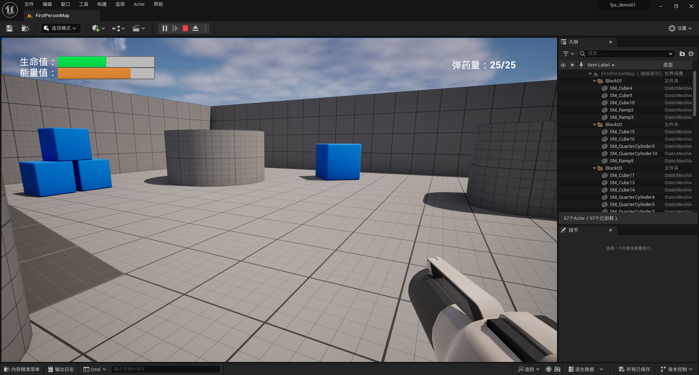

# UE5 学习笔记2：实现FPS游戏的简单 UI

UMG 是 unreal 用于设计 UI 的功能模块，全称为**虚幻示意图形界面设计器（Unreal Motion Graphics UI Designer）**。

下面根据官方文档中提供的教程（[UMG UI设计器快速入门](https://docs.unrealengine.com/5.3/zh-CN/umg-ui-designer-quick-start-guide-in-unreal-engine/)），尝试为一个FPS游戏的画面添加血量和弹药提示。

## 功能描述

左上角显示血量和能量，右上角显示当前弹药量。按 F 键扣血，按空格跳跃，跳跃扣能量。按左键射击，弹药为 0 时停止射击，按 R 键装弹。

## 做法

实现步骤基本与 Unreal [官方教程](https://docs.unrealengine.com/5.3/zh-CN/umg-ui-designer-quick-start-guide-in-unreal-engine/)一致，引擎版本为5.3。原教程很详细，以下只叙述与其中有区别的部分。

创建项目时，在启用 **初学者内容包（Starter Content）** 的情况下使用 **蓝图第一人称（Blueprint First Person）** 模板。

### 调整 Rifle 枪的蓝图

在官方教程中，rifle 枪的行为全部在 BP_Rifle 中定义。而在较新的 Starter Content 包中，将 Rifle 枪的行为分成了拾取前和拾取后两部分，分别于 BP_Pickup_Rifle 和 BP_Weapon_Component 蓝图中定义。

需要做以下调整：
- "**调整BP_Rifle蓝图**" 章节中的调整可以直接在 **BP_Pickup_Rifle** 蓝图中进行。
- "**调整BP_Rifle蓝图中的角色变量**" 章节中的调整需要迁移到 **BP_Weapon_Component** 蓝图中，其中的 **OnFireProjectile Event** 节点由 **EnhancedInputAction IA_Shoot** 节点替代。

### 实现 R 键换弹功能

Starter Content 的 FPS 包里提供了角色的基本移动、空格跳跃和左键开火功能，教程实现了 F 键扣血、跳跃减能量、开枪消耗子弹的功能，并且将这些信息展现在左上角和右上角的 UI 中。

作为练习，我额外实现了 R 键换弹的功能。实现方式与按 F 键扣血的类似，需要在枪械组件蓝图（BP_Weapon_Component）中对该功能进行定义。

首先创建 R 键的 keyboard event 节点，按住 Crtl 键将 **First PersonCharacter** 对象复制到蓝图中，从该对象引脚分别获得 **Get MaxAmmo**(获得最大弹药量) 和 **Set Ammo**(设置弹药量) 的节点。对 SetAmmo 进行如下设置：

## 实现效果

开始时只显示血量和能量。

捡起枪后显示弹药量。

射击消耗弹药。

F键减血量、跳跃减能量。

R键换弹。

### 演示视频

具体可以看链接中的视频演示：[演示视频](https://app.v.tencent.com/cooperation/review/dfbb71f5-696f-4267-a8e8-660ebbb08a65/656ddb1a99605e0001876cbc/2QvP7MMm)

